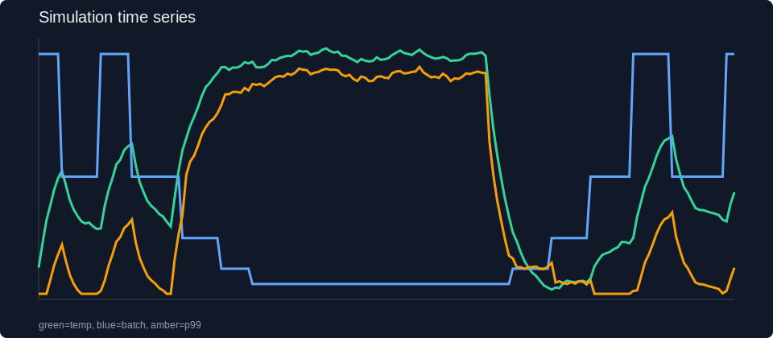
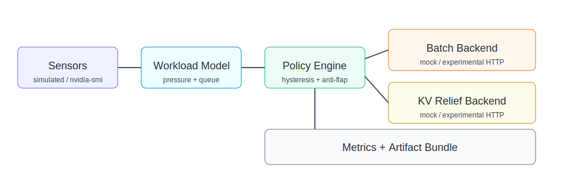
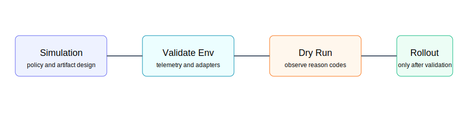

# thermal-ctrl-harness

[](https://github.com/manishklach/thermal-ctrl-harness/actions) [](https://opensource.org/licenses/MIT)

Thermal-control simulation and validation harness for long-context inference.

This repository implements a thermal-aware control-loop prototype for inference systems: temperature sensing, batch-size reduction, optional KV-pressure relief, recovery hysteresis, and observability. The simulation path is first-class and reproducible today, so you can exercise the controller locally without target hardware. Real H100/H200 validation is still required before treating any policy or integration here as production evidence.

## Current evidence level
- **Implemented today**: deterministic simulation runs, policy engine, artifact bundles, mock and experimental adapters, Prometheus-compatible metrics, and reviewer-friendly docs.
- **Simulated / modeled today**: thermal rise under sustained pressure, batch reduction and recovery behavior, latency degradation near thermal limits, KV-relief effects, and baseline-vs-controller comparisons.
- **Not yet hardware-validated**: target-HW thermal behavior, telemetry field availability across driver stacks, real admin/control surfaces in serving systems, and deployment-safe tuning on production workloads.

## What this repo is useful for right now
- exercising a thermal-control loop locally
- comparing baseline vs controller behavior in a reproducible simulation
- generating artifacts, summaries, and charts for design review
- testing observability wiring with Prometheus and Grafana
- preparing for later validation on real H100/H200-class hardware

## Hypothesis and approach
Long-context inference can become sensitive to thermal pressure, especially when queue depth, KV pressure, and sustained batch pressure rise together. One plausible response is a controller that reduces pressure when thermal risk is high, then restores capacity cautiously once the system cools.

This repo implements and demonstrates that control-loop approach. It does not claim to prove that the modeled behavior here matches any specific H100/H200 deployment yet.

## Trust boundaries
- **Simulated**: thermal dynamics, queue growth, latency penalties, KV-relief effects, oscillation risk, and baseline-vs-controller outcome comparisons.
- **Locally measured**: CLI output, generated artifact bundles, config resolution, dashboard wiring, and environment-check results on the machine where you run the repo.
- **Assumed / adapter-based**: shell-based `nvidia-smi` telemetry and HTTP control surfaces such as `/v1/admin/batch` and `/v1/admin/kv_migrate`. These are prototype integration points, not validated universal upstream contracts.
- **Still requires real hardware**: whether `memory.temp` is available and reliable on your GPU stack, whether thermal pressure actually correlates with p99 in your workload, and whether the control policy is beneficial and safe in a live inference service.

## Quickstart
The canonical path is simulation-first.

### 1. Clone and install
```bash
git clone https://github.com/manishklach/thermal-ctrl-harness
cd thermal-ctrl-harness
python -m pip install -r requirements.txt
```

### 2. Run the comparison harness
```bash
python -m thermal_ctrl compare --baseline configs/baseline.yaml --controlled configs/simulated.yaml --seed 7
```

This writes a comparison bundle to:

```text
artifacts/<timestamp>-compare/
```

Inspect these files first:

```text
artifacts/<timestamp>-compare/comparison.md
artifacts/<timestamp>-compare/baseline/summary.md
artifacts/<timestamp>-compare/controlled/summary.md
artifacts/<timestamp>-compare/controlled/timeseries.svg
```

### 3. Validate the local environment
```bash
python -m thermal_ctrl validate-env
```

This checks for `nvidia-smi`, looks for `memory.temp` support when possible, and probes the configured admin URL. A `404` here means an HTTP service responded but the prototype control endpoint is still unconfirmed.

### 4. Optional: run the local demo stack
```bash
docker compose up
```

This starts the local demo-oriented stack and keeps the controller on the simulation path by default. If you are using an older demo flow with a served completion endpoint, `python examples/load_gen.py` can be used as a traffic generator, but it is not required for the canonical simulation workflow.

Grafana is available at [http://localhost:3000](http://localhost:3000) and Prometheus at [http://localhost:9090](http://localhost:9090).

## Example output from the simulation harness
The table below is a simulated comparison produced by the checked-in model with `seed=7`. These values are useful for reasoning about tradeoffs inside the harness; they are not hardware benchmark claims.

| Scenario | Peak temp | Time above threshold | Simulated p99 | Avg batch | Throughput |
| --- | --- | --- | --- | --- | --- |
| Baseline (`configs/baseline.yaml`) | 97.77 C | 174 s | 4904.62 ms | 256.0 | 331.86 toks/s |
| Controlled (`configs/simulated.yaml`) | 97.54 C | 97 s | 4207.22 ms | 88.8 | 180.96 toks/s |

In this modeled scenario, the controller reduces time above threshold and modeled p99 at the cost of throughput and average batch size. That tradeoff is the point of the harness: inspect it, tune it, and decide what should be validated next on real hardware.

Example chart:



## Control-loop components
- **Temperature sensing**
  - `SimulatedTemperatureSensor` for deterministic local runs
  - `NvidiaSmiTemperatureSensor` as a best-effort shell-based adapter
- **Control policy**
  - thermal threshold and recovery hysteresis
  - minimum dwell time
  - cooldown before recovery
  - anti-flap action budget
  - degraded hold mode after repeated backend failures
- **Pressure relief**
  - optional KV-relief concept in the simulation model
  - mock and experimental backends for future integration work
- **Observability**
  - Prometheus-compatible metrics
  - Grafana dashboard files
  - artifact bundles with CSV, JSON, Markdown, and SVG output

## Prototype integration points
This repo currently treats the following as adapter targets, not established production contracts:
- `nvidia-smi --query-gpu=memory.temp`
- `HTTPAdminBatchBackend`
- `HTTPAdminKVMigrationBackend`
- endpoints such as `/v1/admin/batch` and `/v1/admin/kv_migrate`

If you want to wire the controller to a real inference stack, validate those surfaces in your environment first. See [docs/validation_playbook.md](docs/validation_playbook.md).

## Configuration
The main simulation config is [configs/simulated.yaml](configs/simulated.yaml). Key policy settings:

```yaml
policy:
  throttle_temp_c: 85.0
  recover_temp_c: 80.0
  min_batch_size: 16
  max_batch_size: 256
  initial_batch_size: 256
  throttle_step_ratio: 0.5
  recover_step_ratio: 2.0
  min_dwell_s: 8
  cooldown_s: 10
  anti_flap_window_s: 30
  max_actions_per_window: 3
  kv_migration_pct: 0.12
  degraded_retries_before_hold: 2
```

The baseline scenario lives in [configs/baseline.yaml](configs/baseline.yaml). A local dry-run-oriented config lives in [configs/config.yaml](configs/config.yaml).

## Visuals and docs




- [docs/architecture.md](docs/architecture.md)
- [docs/simulation_model.md](docs/simulation_model.md)
- [docs/policy.md](docs/policy.md)
- [docs/failure_modes.md](docs/failure_modes.md)
- [docs/validation_playbook.md](docs/validation_playbook.md)
- [docs/faq.md](docs/faq.md)

## Real-hardware validation path
Real-hardware use is validation-oriented and secondary to the simulation workflow in this repo.

If you have access to H100/H200-class hardware:
1. run the simulation path first
2. run `python -m thermal_ctrl validate-env`
3. confirm telemetry availability and control-surface semantics
4. use dry-run mode before real actions
5. compare real traces against the simulated artifacts instead of assuming they will match

Validation notes are in [docs/validation_playbook.md](docs/validation_playbook.md). A short pointer also remains in [VALIDATION.md](VALIDATION.md).

## Repo structure
```text
thermal_ctrl/
  backends/          mock and experimental backend adapters
  controllers/       policy engine
  sensors/           simulated and best-effort telemetry adapters
  artifacts.py       artifact bundle generation
  cli.py             user-facing CLI
  runtime.py         simulation runtime
configs/
  baseline.yaml      baseline comparison scenario
  simulated.yaml     controller-enabled simulation scenario
  config.yaml        local dry-run-oriented config
docs/
  architecture.md
  simulation_model.md
  policy.md
  failure_modes.md
  validation_playbook.md
  faq.md
examples/
  load_gen.py        optional traffic generator for older demo flows
```

## Known limitations
- No target-HW validation is included yet.
- The simulation uses a simplified thermal and latency model.
- Telemetry field availability may vary by GPU, driver, and platform.
- Admin/control endpoints may require adapter work depending on the inference stack.
- The policy is intentionally simple and not deployment-tuned.

## Release notes
Recent release history:
- [v0.2.1](https://github.com/manishklach/thermal-ctrl-harness/releases/tag/v0.2.1) - hardening pass for reviewer clarity and trust boundaries
- [v0.2.0](https://github.com/manishklach/thermal-ctrl-harness/releases/tag/v0.2.0) - simulation-harness refactor

## License
MIT
