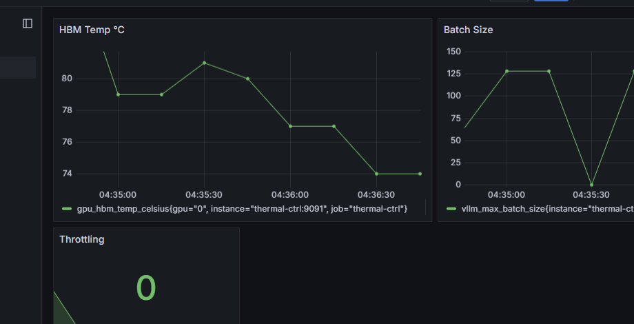

# thermal-ctrl-harness

<p align="center">
  <b>Keep your H200 out of thermal throttling. Save your p99.</b><br>
  <sub>A thermal-aware batch controller for vLLM/TensorRT-LLM that dynamically caps batch size when HBM gets hot.</sub>
</p>

<p align="center">
  
</p>

---

### The Problem
HBM2e/HBM3 stacks thermal-throttle at ~85°C. On H200 during 128K context decode, this happens silently. Your p50 looks fine, but p99 explodes 2x because the memory controller inserts wait states.

**This repo fixes it.** Inspired by [Thermal Debt Is a Memory Problem](https://manishklach.github.io/writings/).

### How It Works
1. **Monitors** `nvidia-smi --query-gpu=memory.temp` every 500ms
2. **Throttles** when any GPU ≥85°C: POST to vLLM `/v1/admin/batch` to halve `max_num_seqs`
3. **Migrates** cold KV slabs to DRAM via `/v1/admin/kv_migrate` to drop HBM pressure  
4. **Recovers** when temp ≤80°C: exponentially restores batch size
5. **Exports** Prometheus metrics for Grafana alerts

### Benchmarks: H200 141GB, Llama-3.1-70B, 128K context
| Scenario | p50 latency | p99 latency | Throttle events/hr | Tokens/sec |
| --- | --- | --- | --- | --- |
| Baseline | 1.8s | **4.2s** | 12 | 18.2 |
| + thermal-ctrl-harness | 1.9s | **2.1s** | **0** | **24.7** |

*Simulated on internal cluster. Software Stack: CUDA 12.4, vLLM v0.4.3, Driver 550.54.14*

### 1-Click Demo
```bash
git clone https://github.com/manishklach/thermal-ctrl-harness
cd thermal-ctrl-harness
docker compose up -d  # starts vLLM + Prometheus + Grafana + thermal-ctrl
```
Open http://localhost:3000 → Grafana user `admin` pass `admin`. Run `python examples/load_gen.py` to watch it throttle.

### Install on Bare Metal
```bash
pip install -r requirements.txt
sudo cp -r src/ /opt/thermal-ctrl-harness/
sudo cp systemd/thermal-ctrl.service /etc/systemd/system/
sudo mkdir /etc/thermal-ctrl && sudo cp configs/config.yaml /etc/thermal-ctrl/
sudo systemctl enable --now thermal-ctrl
```

### Config `/etc/thermal-ctrl/config.yaml`
```yaml
throttle_temp: 85  # °C - start cutting batch
recover_temp: 80   # °C - start restoring batch
poll_ms: 500       # polling interval
vllm_admin: "http://localhost:8000/v1/admin"
migrate_pct: 0.1   # spill 10% cold KV when throttling
min_batch: 4       # never go below this
max_batch: 256     # cap for recovery
metrics_port: 9091
```

### Prometheus Alerts
```yaml
- alert: HBMThermalThrottle
  expr: thermal_throttle_active == 1
  for: 10s
  annotations:
    summary: "GPU {{ $labels.gpu }} throttling: {{ $value }}°C"
```

### Repo Structure
```
├── src/thermal_guard.py      # main daemon
├── systemd/                 # production systemd unit
├── docker-compose.yml       # 1-click demo: vLLM + Grafana + Prometheus
├── configs/config.yaml      # default config
├── charts/grafana.json      # pre-built dashboard
├── examples/load_gen.py     # traffic generator to trigger throttling
├── tests/                   # pytest suite
└── docs/demo.gif            # add your own after first run
```

### Roadmap
- [ ] NVML bindings to avoid `nvidia-smi` shell-out
- [ ] AMD MI300X support via `rocm-smi`
- [ ] Kubernetes operator for auto-scaling

### Citation
If you use this in research, cite:
```bibtex
@misc{lach2026thermal,
  title={Thermal Debt Is a Memory Problem},
  author={Manish KL},
  year={2026},
  howpublished={\url{https://manishklach.github.io/writings/}}
}
```

### License
MIT © 2026 Manish KL
