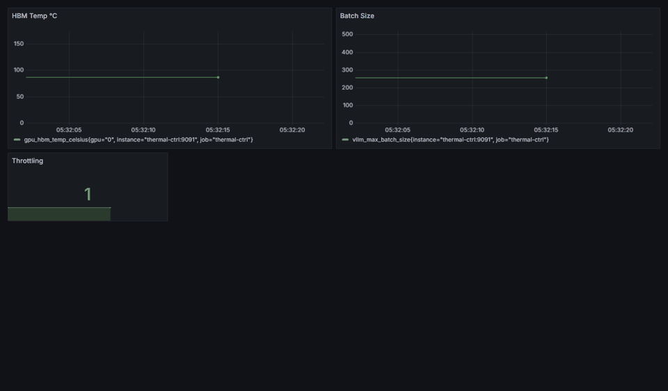
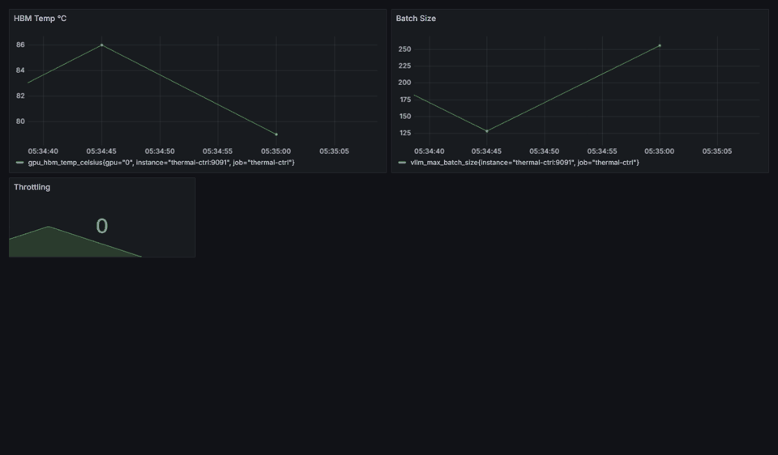

# thermal-ctrl-harness

[](https://github.com/manishklach/thermal-ctrl-harness/actions) [](https://opensource.org/licenses/MIT)

Thermal-control simulation and validation harness for LLM inference systems.

This repository is an honest systems prototype: it models thermal pressure, queueing pressure, batch-size control, KV-relief actions, and recovery hysteresis so infra engineers can reason about control-loop behavior before they ever touch an H100 or H200.

## Current Evidence Level
1. **Implemented today**
   Deterministic simulation, adapter-based control loop, artifact bundles, policy controls, environment validation, mock and experimental backends, Prometheus-compatible metrics emission.
2. **Simulated / modeled**
   Thermal rise under long-context pressure, latency degradation near thermal limits, KV-relief effects, oscillation risk, baseline-vs-controlled comparisons.
3. **Not yet hardware-validated**
   Real H100/H200/HBM behavior, upstream admin endpoint semantics, production-safe control gains, multi-GPU coordination on a live cluster.

## Why this repo is useful even without hardware
- It gives you a reproducible harness for comparing policy choices before rollout.
- It makes trust boundaries explicit: simulated, measured, assumed, and still unknown are separated.
- It provides extension points for real sensors and serving backends without pretending they are already validated.
- It generates reviewable artifacts that can be shared in design docs, RFCs, or PRs.

## Trust Boundaries
- **Simulated**: temperature dynamics, queue growth, thermal-latency coupling, KV spill relief, recovery hysteresis, oscillation behavior.
- **Assumed**: HTTP admin adapters that resemble batch-control or KV-migration surfaces; these are experimental and may not match your serving stack.
- **Measured locally**: deterministic CLI output, generated artifact files, and environment-check results on the machine where you run the commands.
- **Still to confirm on real accelerators**: whether `nvidia-smi --query-gpu=memory.temp` is available and stable on your hardware, whether thermal risk correlates with p99 in your workload, and how safe automated control is for your inference stack.

## Quick Start
From the repo root, install the small Python dependency set:

```bash
python -m pip install -r requirements.txt
```

Then run the canonical local review path:

```bash
python -m thermal_ctrl compare --baseline configs/baseline.yaml --controlled configs/simulated.yaml --seed 7
python -m thermal_ctrl validate-env
```

That command generates a comparison bundle in `artifacts/<timestamp>-compare/` with:
- config snapshots
- event logs
- time series CSV
- summary markdown
- SVG plots
- baseline vs controlled comparison report

Inspect these files first:

```bash
artifacts/<timestamp>-compare/comparison.md
artifacts/<timestamp>-compare/baseline/summary.md
artifacts/<timestamp>-compare/controlled/summary.md
```

## Simulation Mode
Simulation is a first-class surface in this repo, not a hidden fallback.

The toy model is intentionally simple and inspectable:
- sustained request pressure raises modeled HBM temperature
- crossing the throttle threshold triggers a batch reduction
- optional KV migration reduces pressure for a few steps
- recovery happens only after hysteresis plus dwell/cooldown limits
- latency gets worse as queue depth and thermal pressure rise
- poor tuning can create oscillation, which is surfaced in the artifact bundle


### Typical commands
```bash
python -m thermal_ctrl simulate --config configs/simulated.yaml --seed 7
python -m thermal_ctrl compare --baseline configs/baseline.yaml --controlled configs/simulated.yaml --seed 7
python -m thermal_ctrl dry-run --config configs/config.yaml --seed 7
python -m thermal_ctrl validate-env
```

`simulate` writes a single scenario bundle. `compare` writes a bundle with `baseline/` and `controlled/` subdirectories plus a top-level `comparison.md`.

## Adapter Surface
This repo is intentionally not hard-coded to any single inference server.

### Sensors
- `SimulatedTemperatureSensor` - `mock-only`
- `NvidiaSmiTemperatureSensor` - `production-possible`, best-effort shell-based

### Backends
- `MockBatchBackend` - `mock-only`
- `MockKVMigrationBackend` - `mock-only`
- `HTTPAdminBatchBackend` - `experimental`
- `HTTPAdminKVMigrationBackend` - `experimental`

The HTTP admin adapters exist as extension points. They should be treated as prototype integrations until you validate them against your own stack.

## Control Policy
The controller is no longer a simple threshold toggle. The policy engine includes:
- hysteresis
- minimum dwell time
- cooldown before recovery
- anti-flap action budget
- bounded step-down and recovery rates
- degraded hold mode after repeated backend failures
- dry-run support
- per-GPU control state
- reason-coded event logs

See [docs/architecture.md](docs/architecture.md), [docs/simulation_model.md](docs/simulation_model.md), and [docs/failure_modes.md](docs/failure_modes.md) for details.

## Reproducible Demo Artifacts
The repo ships example GIFs from the simulation harness:

| Baseline | Controlled |
| --- | --- |
|  |  |
| fixed high pressure, no relief | batch reduction plus recovery hysteresis |

Example generated chart from simulation mode:


## Simulated Scenario, Not Hardware Benchmark
The comparison below is a modeled scenario produced by the simulation harness with `seed=7`. It is useful for reasoning about policy behavior, not for claiming production H200 results.

| Scenario | Peak temp | Time above threshold | Simulated p99 | Avg batch | Throughput |
| --- | --- | --- | --- | --- | --- |
| Baseline (`configs/baseline.yaml`) | 97.77 C | 174 s | 4904.62 ms | 256.0 | 331.86 toks/s |
| Controlled (`configs/simulated.yaml`) | 97.54 C | 97 s | 4207.22 ms | 88.8 | 180.96 toks/s |

Run the compare command above to generate your own numbers from the checked-in model.

## Environment Validation
Use the built-in validator before wiring real telemetry or HTTP adapters:

```bash
python -m thermal_ctrl validate-env
```

It reports:
- whether `nvidia-smi` is present
- whether `memory.temp` appears to be queryable
- whether the configured admin URL responds, and whether the control endpoint is still unconfirmed
- what this repo considers supported versus still experimental

It does **not** claim your environment is hardware-validated.

## Known Limitations
- No target-HW validation is included in this repo today.
- The local simulation is a simplified control-study model, not a hardware thermal simulator.
- HTTP backends are adapter stubs for experimentation and may require custom integration work in real inference stacks.
- Telemetry availability varies by GPU, driver, and platform; `memory.temp` should be validated in your environment.
- The control policy is intentionally simple and conservative; it is not tuned for all deployments.

## File Map
```text
thermal_ctrl/
  backends/          adapter implementations
  controllers/       policy engine
  sensors/           simulated and best-effort hardware sensors
  artifacts.py       run bundle generation
  cli.py             user-facing commands
  runtime.py         simulation runner
configs/
  baseline.yaml      no-control comparison scenario
  simulated.yaml     controlled scenario
docs/
  architecture.md
  simulation_model.md
  failure_modes.md
  policy.md
  validation_playbook.md
  faq.md
```

## Docs
- [docs/architecture.md](docs/architecture.md)
- [docs/simulation_model.md](docs/simulation_model.md)
- [docs/failure_modes.md](docs/failure_modes.md)
- [docs/policy.md](docs/policy.md)
- [docs/validation_playbook.md](docs/validation_playbook.md)
- [docs/faq.md](docs/faq.md)
- [CHANGELOG.md](CHANGELOG.md)

## Release Notes
v0.2.1 tightens the public story, clarifies endpoint-validation semantics, and makes the default reviewer workflow easier to follow without changing the repo's scope.

## License
MIT
